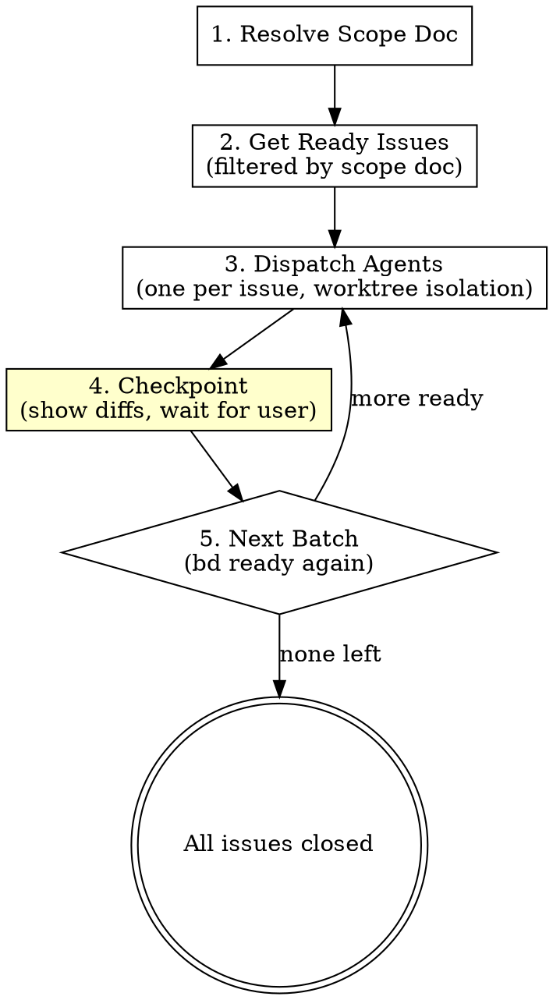

# Execute Plan — Parallel Agent Dispatch

Reads `bd ready` issues for a specific scope doc, dispatches one CC agent per issue in an isolated worktree, and manages checkpoint gates between batches.

## When to Use

- User says "execute the plan", "dispatch agents", "run the plan"
- bd issues already exist (created via `bd-create-from-plan.sh`)
- **Skip when:** No bd issues exist yet — tell user to run `bd-create-from-plan.sh` first

## Pipeline



## Step 1: Resolve Scope Doc

Find the scope doc for this initiative:

1. If user specifies a name or path, use that
2. Otherwise, list files in `~/.claude/projects/<project-path>/scopes/` and show the user recent ones to pick from
3. Read the scope doc — you'll need: Goal, Approach, Success Criteria, and the full Tasks section

```bash
ls -lt ~/.claude/projects/<project-path>/scopes/*.md | head -5
```

**Store the scope doc path** — you'll pass it to every agent.

## Step 2: Get Ready Issues for This Scope Doc

```bash
bd ready --json
```

Filter the results: only issues whose description contains `Source: <scope-doc-path>`. This scopes dispatch to one initiative — the user may have bd issues from other plans that should not be touched.

If no ready issues match this scope doc:
- Check if there are in-progress issues (another agent may be working)
- Check if all issues for this scope are closed (plan is complete)
- Tell the user what's happening

**Display the batch** before dispatching:

```
Ready to dispatch 3 agents:
  conductor-abc: Add booking models
  conductor-def: Implement Radiant client
  conductor-ghi: Wire up Temporal activities

Scope doc: ~/.claude/projects/.../scopes/2026-04-09-booking-agent.md

Dispatch? (or pick specific issues)
```

Wait for user confirmation before dispatching. They may want to reorder, skip some, or only run a subset.

## Step 3: Dispatch Agents

For each confirmed issue, dispatch one Agent with worktree isolation:

```
Agent tool call:
  description: "<issue-id>: <short title>"
  isolation: "worktree"
  run_in_background: true
  prompt: <see agent prompt template below>
```

**Dispatch all agents in a single message** (parallel tool calls). Each runs in its own worktree — no file conflicts.

### Agent Prompt Template

Construct each agent's prompt with this structure. Paste content inline — agents cannot read scope docs or bd issues themselves efficiently.

```markdown
You are implementing a task from a plan. Work in this worktree — it's your isolated workspace.

## Your Task

**Issue:** <issue-id>
**Title:** <issue title>

<Paste the full bd issue description here>

## Scope Context

**Goal:** <goal from scope doc>
**Approach:** <approach from scope doc>

### Success Criteria
<paste success criteria from scope doc>

### Your Task's Section from the Plan
<paste the specific PR/task section this issue belongs to>

## Codebase Map

<paste the relevant section from project CLAUDE.md — the architecture overview, key files, and code style rules>

## Instructions

1. **Claim the issue:**
   ```
   bd update <issue-id> --claim
   ```

2. **Implement the task:**
   - Follow the codebase's patterns and style (see Codebase Map above)
   - Write tests if the project has a test framework for this area
   - Use type hints (Python) or TypeScript types (frontend)
   - Keep changes focused — only touch what the task requires

3. **Run available checks:**
   - If Python: `make format && make type-check` and run relevant tests
   - If TypeScript: `pnpm format-and-lint:fix` and run relevant tests
   - If no automated checks apply to this task, note that in your report

4. **Commit your work:**
   - Conventional commit: `<type>(<scope>): <description>`
   - Include a body explaining WHY, not WHAT
   - One logical change per commit
   - Do NOT add Co-Authored-By lines

5. **Report back with this format:**

   ```
   ## Status: DONE | DONE_WITH_CONCERNS | BLOCKED | NEEDS_CONTEXT

   ## What I Did
   <2-3 sentences>

   ## Files Changed
   <list files>

   ## Automated Check Results
   <test output summary, lint results, or "no automated checks for this task">

   ## Concerns or Notes
   <anything the reviewer should know, manual verification needed, etc.>
   ```

## Important

- Do NOT close the bd issue — the human reviews and closes it
- Do NOT push to remote — commits stay local in the worktree
- If you're stuck or need context you don't have, report NEEDS_CONTEXT or BLOCKED
  with a clear description of what's missing. Don't guess.
- If the task requires manual verification (testing on hardware, checking a UI,
  validating against an external system), note that clearly in your report
```

### Adapting the Prompt

**For infrastructure tasks** (Terraform, Helm, CI/CD): Replace the "Run available checks" section with `terraform fmt`, `terraform validate`, `helm template`, etc. Reference staff-sre patterns instead of TDD.

**For tasks with known manual verification:** Add a note in the Instructions section: "This task requires manual verification: <what needs to be checked>. Implement and commit, then report DONE_WITH_CONCERNS noting what the human needs to verify."

## Step 4: Checkpoint

As each agent completes (you'll be notified), present its results to the user:

```
## Agent completed: conductor-abc — Add booking models

**Status:** DONE
**Worktree:** /tmp/worktree-abc (branch: agent/conductor-abc)

### What it did
Added Pydantic models for booking requests and responses...

### Files changed
 src/models/booking.py | 45 +++
 tests/test_booking.py | 62 +++

### Automated checks
Tests: 4/4 passing
Lint: clean
Type-check: clean

### Agent notes
None — straightforward implementation.

---
**Actions:**
- Review the diff: `git -C /tmp/worktree-abc diff main`
- Approve and close: `bd close conductor-abc`
- Send feedback: I'll relay it to the agent
- Discard: `git worktree remove /tmp/worktree-abc`
```

**Wait for user action on each agent result.** Do not auto-proceed.

If the user needs to do manual verification (on-prem testing, UI check), they'll come back later. That's fine — the worktree persists.

If the user wants fixes, use `SendMessage` to the agent (by its ID) with specific feedback. The agent resumes in its worktree with full context.

## Step 5: Next Batch

After the user has reviewed all agents in the current batch:

```bash
bd ready --json
```

Filter again by the scope doc. If more issues are now unblocked (because their dependencies were just closed), offer to dispatch the next batch. Same flow: show the batch, confirm, dispatch.

If no more ready issues and all scope-doc issues are closed: the plan is complete. Offer to proceed to finishing-a-development-branch (merge worktree branches, create PRs).

## Merging Worktree Results

After issues are closed, the user decides how to integrate worktree branches:

- **Stack with av:** `av branch nil/<feature>` then cherry-pick or merge each worktree branch
- **Individual PRs:** Each worktree branch becomes its own PR
- **Single PR:** Merge all worktree branches into one feature branch

The skill does NOT prescribe this — it depends on the initiative's PR strategy (defined in the scope doc's "PR Breakdown" section). Remind the user of what the scope doc says.

## Error Handling

**Agent returns BLOCKED or NEEDS_CONTEXT:**
- Show the agent's report to the user
- User provides context or adjusts the task
- Re-dispatch with SendMessage to the same agent, or dispatch a new agent with updated instructions

**Agent returns DONE_WITH_CONCERNS:**
- Show concerns prominently
- User decides: accept as-is, send fixes, or discard and redo

**Agent makes no changes (worktree auto-cleaned):**
- This means the agent couldn't do anything — likely BLOCKED
- Show the agent's report and figure out why

**Conflicting changes across agents:**
- Rare if tasks are truly independent (scope-refine should ensure this)
- If it happens: merge one worktree first, then rebase the other and fix conflicts
- Use `git rerere` (already enabled) to remember conflict resolutions

## Rules

- **Never dispatch without user confirmation** — show the batch first
- **Never close bd issues automatically** — the human reviews and closes
- **Never push to remote** — agents commit locally in worktrees
- **Always filter by scope doc** — don't touch other initiatives' issues
- **Always paste context inline** — don't make agents read files to find their task
- **Respect task dependencies** — only dispatch issues that `bd ready` returns (deps already resolved)

## Integration

| Skill | Relationship |
|-------|-------------|
| scope-refine | Produces the scope doc this skill reads |
| staff-swe | References this skill for step 3 (Execute) when tasks are parallelizable |
| staff-sre | Same — for infrastructure tasks |
| superpowers:test-driven-development | Agents use this within their worktrees |
| superpowers:finishing-a-development-branch | After all issues closed, merge and ship |
| superpowers:dispatching-parallel-agents | **Replaced by this skill** for plan execution (that skill is still useful for ad-hoc parallel debugging) |
