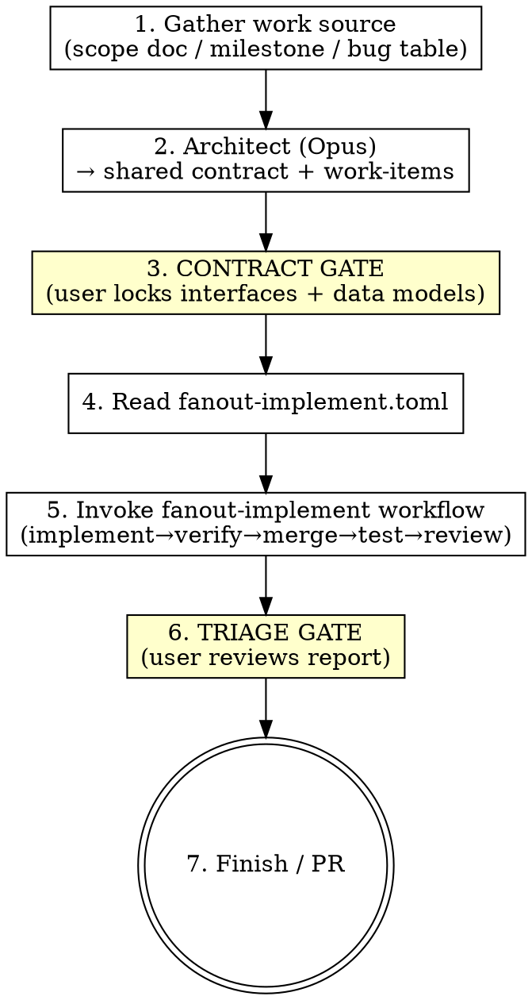

# Execute Plan — Architect + Parallel Fan-Out

The shared back half for ALL implementation work. Takes any source of work — a `scope-refine` doc, a prioritized Linear milestone (read via the `linear` CLI), or an ad-hoc bug table pasted in chat — and ships it through one deterministic pipeline. No bd.

## When to Use

- User says "execute the plan", "fan this out", "implement these", "run the plan"
- The work decomposes into **2+ independent work-items**
- **Skip when** there's a single, tightly-coupled change → use `superpowers:test-driven-development` directly. Fan-out has no payoff for one item.

## Pipeline


```dot
digraph execute_plan {
    rankdir=TB;
    source    [label="1. Gather work source\n(scope doc / milestone / bug table)", shape=box];
    architect [label="2. Architect (Opus)\n→ shared contract + work-items", shape=box];
    gate1     [label="3. CONTRACT GATE\n(user locks interfaces + data models)", shape=box, style=filled, fillcolor="#ffffcc"];
    config    [label="4. Read fanout-implement.toml", shape=box];
    run       [label="5. Invoke fanout-implement workflow\n(implement→verify→merge→test→review)", shape=box];
    gate2     [label="6. TRIAGE GATE\n(user reviews report)", shape=box, style=filled, fillcolor="#ffffcc"];
    finish    [label="7. Finish / PR", shape=doublecircle];

    source -> architect -> gate1 -> config -> run -> gate2 -> finish;
}
```

## Step 1: Gather the work source

Identify what's being implemented and **where**:
- A `scope-refine` doc under `~/.claude/projects/<project>/scopes/`, OR
- A prioritized Linear milestone (read issues via the `linear` CLI, then prioritize), OR
- A bug table / notes the user pasted in chat.

Establish and confirm: **repo path** and **base branch** (the workflow needs both). The user's cwd is usually the repo.

## Step 2: Architect the shared contract (Opus)

Dispatch ONE architect agent (model: opus). Its job is the HOW, not the WHAT — turn the source into:

- A **SHARED CONTRACT**: the **interfaces + DATA MODELS** (DB schema, DTOs, domain models) every implementer must honor, the **design principles** (no bandaids, build for extensibility, the target system shape), the **verification method** (TDD for app code; validate→plan→fmt for infra), and explicit **NON-GOALS**.
- A set of **disjoint WORK-ITEMS**: `{id, title, files[], interface, depends_on[], spec}`. Items must be **file-disjoint** so they merge cleanly — the contract is what decouples them so each can be built against agreed interfaces without the others' code present.

Have the architect return this as structured data (work-items + contract string). The contract is the thing that prevents agents drifting — make it specific.

## Step 3: CONTRACT GATE (human) — the alignment checkpoint

Show the user the **shared contract — especially the interfaces + data models** — and the work-item breakdown. This is where they lock the design. They may rewrite interfaces, merge/split items, add non-goals, or tighten the spec.

**Wait for approval. Do NOT proceed until they sign off.** This single upstream review is where their judgment has the most leverage — it propagates into every implementer.

## Step 4: Pick models (defaults are fine)

The workflow defaults **every stage to opus** and `baseBranch` to `main` — no config file to read. Only build a `models` override (e.g. `{ implement: "sonnet" }`) if the user explicitly asks to tier a stage down, and only pass `baseBranch` if it differs from `main`.

## Step 5: Invoke the workflow

Call the **Workflow** tool:

```
Workflow({
  scriptPath: "/Users/nilay/.claude/workflows/fanout-implement.js",
  args: {
    repoPath:       "<repo path>",
    baseBranch:     "<base branch>",
    feature:        "<short-feature-slug>",
    sharedContract: "<the approved contract string>",
    workItems:      [ {id, title, files, interface, depends_on, spec}, ... ],
    models:         { implement, verify, merge, test, review }   // OMIT unless overriding; defaults to opus
  }
})
```

The workflow runs Implement → Verify-item → Merge → Test → Pre-PR review on its own and returns a structured report. You do NOT manage worktrees, merging, or dispatch by hand — that's the whole point.

## Step 6: TRIAGE GATE (human)

**Open with where the result is** — the workflow returns `resultBranch` + `integrationWorktree`. Lead the report with: *"Everything merged onto branch `<resultBranch>`, checked out at `<integrationWorktree>`. Item branches: `nil/<feature>-<id>`. Fresh copy elsewhere: `git -C <repo> worktree add ../<feature>-integration <resultBranch>`."* Point at the branch, never at a `wf_*` scratch path.

Then present:
- per-item status + which **passed verify**
- **flagged** items (failed verify after one redo) — with the reviewer's reason
- merge **conflicts** — `semantic` ones need the user; `syntactic` were auto-resolved
- **test** results
- **review findings** by severity (bugs / simplify / arch / impl)

The user decides what to fix. To redo flagged/failed items: re-invoke the workflow with `resumeFromRunId` (completed items are cached, only the fixes re-run), or re-dispatch just those items. Then hand off to `superpowers:finishing-a-development-branch` / `av` for PRs.

## Rules

- **Never invoke the workflow before the contract gate passes.** Bad decomposition is the #1 failure mode; the gate is the cheap insurance.
- **Never push or create PRs without explicit user approval** (per `~/.claude/CLAUDE.md`).
- **Model tiers default to opus in the workflow** — override per-run via `args.models` only when asked. No separate config file to maintain.
- The workflow flags semantic conflicts for the human — it never last-writer-wins. Trust that; review the flags.

## Integration

| Skill | Relationship |
|-------|-------------|
| scope-refine | One intake — produces the plan this reads (single feature) |
| Linear milestone | Intake — read issues via the `linear` CLI, prioritize, then run this |
| ad-hoc analysis | Another intake — a chat-built bug table; user says "fan this out" |
| staff-swe / staff-sre | Wrap this with security review + finishing discipline; call it for step "Execute" |
| fanout-implement (workflow) | The deterministic engine this invokes |
| superpowers:finishing-a-development-branch | After triage, merge and ship |
