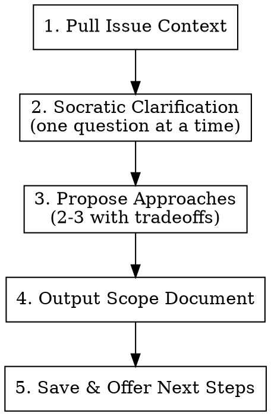

# Scope & Refine

## Overview

Understand the problem before solving it. This skill produces a refined scope document through Socratic questioning — not code, not a plan, not an implementation.

**This skill runs BEFORE brainstorming.** Brainstorming assumes a clear scope. This skill creates that clarity.

## When to Use

**Always when:**
- User says "refine", "scope", or "let's think about"
- A Linear/issue tracker ID is mentioned (e.g., AUTO-XXX)
- Requirements are vague or ambiguous
- Starting work on a new milestone or epic

**Never when:**
- Scope is already clear and user wants to start building
- User explicitly says "skip scoping" or "just build it"

## Pipeline



## Step 1: Pull Issue Context

If an issue ID is detected in the prompt:

```bash
# Uses $ISSUE_TOOL from ~/.config/claude/workflow.env
# Default: linear issue show AUTO-XXX
$ISSUE_SHOW_CMD <issue-id>
```

If the command is available, pull the issue and inject its title, description, and labels as context. If not available or no issue ID, proceed with what the user provided.

**Do NOT ask the user to paste the issue.** Pull it programmatically or work with what you have.

## Step 2: Socratic Clarification

**One question at a time.** Not a wall of questions. Not a numbered list.

Ask the most important clarifying question, wait for the answer, then ask the next one based on what you learned. Stop when you have enough to propose approaches (usually 2-5 questions).

**Good questions — scope & intent:**
- "What does success look like for this?" (defines done)
- "Who consumes the output of this?" (defines interface)
- "What's the simplest version that would be useful?" (scopes MVP)
- "What's explicitly out of scope?" (boundaries)

**Good questions — technical constraints that change scope:**
- "Does this need to be real-time or is batch acceptable?" (architecture driver)
- "What scale are we designing for — 10 users or 10,000?" (complexity driver)
- "Does this need to work across regions or single-region?" (infra scope)
- "Is there an existing service/module this should extend vs. building new?" (build vs. extend)
- "What auth/access model applies here — per-user, per-team, service-to-service?" (security scope)
- "Are there compliance constraints — PHI, PII, audit logging?" (non-functional scope)

**Bad questions:**
- Pure implementation details ("Should we use Redis or Memcached?" — that's brainstorming)
- Things you can answer by reading the codebase
- Yes/no questions that don't reveal intent

## Step 3: Propose Approaches

Present 2-3 approaches in a comparison table:

```markdown
| Approach | Description | Pros | Cons |
|----------|-------------|------|------|
| A: ... | ... | ... | ... |
| B: ... | ... | ... | ... |
| C: ... | ... | ... | ... |

**Recommendation:** Approach A, because ...
```

Always have a recommendation. Don't present options without an opinion.

If there's only one reasonable approach, say so — don't invent alternatives for the sake of having options.

## Step 4: Output Scope Document

After the user picks an approach (or agrees with the recommendation), produce a scope document:

```markdown
# Scope: [Feature Name]

**Issue:** [ID if available]
**Goal:** [One sentence]
**Approach:** [Chosen approach, 2-3 sentences]

## In Scope
- [Specific deliverable 1]
- [Specific deliverable 2]

## Out of Scope
- [Explicitly excluded thing 1]
- [Explicitly excluded thing 2]

## Open Questions
- [Anything still unresolved — to be answered during brainstorming/planning]

## Dependencies
- [External dependencies: other teams, services, credentials needed]
```

## Step 5: Save & Offer Next Steps

Save the scope document to `docs/scopes/YYYY-MM-DD-<feature-name>.md` (create the directory if needed).

Then offer:

**"Scope saved to `docs/scopes/<filename>.md`. Next steps:**
1. **Brainstorm** — I'll use superpowers:brainstorming to design the implementation
2. **Defer** — Save this for later, pick it up in another session
3. **Refine more** — Keep scoping if things are still unclear

**Which one?"**

## Hard Rules

- **No code.** Not even pseudocode. This is about WHAT, not HOW.
- **No plans.** Plans come from superpowers:writing-plans after brainstorming.
- **No implementation opinions.** "Use library X" is brainstorming territory, not scoping.
- **One question at a time.** Walls of questions overwhelm. Be conversational.
- **Always have an opinion.** Don't present options without a recommendation.
