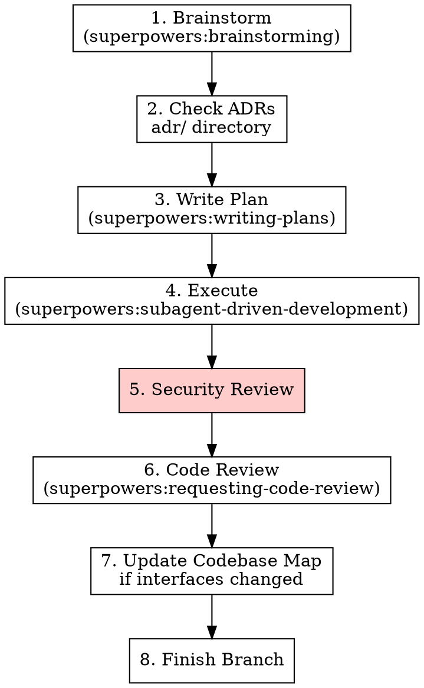

# Staff SRE — Infrastructure Development

## Overview

Infrastructure code doesn't have unit tests. Verification means: does `terraform validate` pass, does `terraform plan` show only expected changes, and does the security posture hold?

**This skill replaces test-driven-development for infrastructure repos.**

All other Superpowers skills (brainstorming, writing-plans, subagent-driven-development, verification-before-completion, code review) still apply unchanged.

## When to Use

**Always when:**
- Working in a repo with Terraform modules
- Modifying Helm values templates, CI/CD workflows, or Kubernetes manifests
- The project CLAUDE.md says "use staff-sre"

**Never when:**
- Writing application code, agents, or services (use test-driven-development instead)

## Pipeline



## Step 2: Check ADRs

**Before planning, read `adr/` in the repo root.**

- Do any existing ADRs constrain this work?
- Will this work require a new architectural decision?
- If yes: write the ADR as part of the plan (use MADR minimal template at `adr/0000-template.md`)

## Step 4: Infrastructure Verification Cycle

This replaces the TDD Red-Green-Refactor cycle. For each task in the plan:

### VALIDATE — Check Syntax

```bash
terraform validate
```

Confirm: no syntax errors, no missing variables, no provider issues.

**Fails?** Fix the error. Re-validate. Don't proceed until clean.

### PLAN — Check Expected Changes

```bash
terraform plan
```

Confirm:
- Only expected resources are added/changed/destroyed
- No unexpected drift or destroy operations
- Variable interpolations resolve correctly
- Count/for_each conditions evaluate as intended

**Unexpected changes?** Investigate before proceeding. Never ignore plan output.

### FORMAT — Enforce Style

```bash
terraform fmt -check
```

Should pass automatically (PostToolUse hook runs `terraform fmt` on save). If not, run `terraform fmt` and re-check.

### Commit

After validate + plan + format are clean, commit following the conventions in `~/.claude/CLAUDE.md` (Commit Conventions section). Use `$STACK_TOOL` commands from `~/.config/claude/workflow.env` if stacking.

## Step 5: Infra Security Review

**Before requesting code review, check:**

| Check | What to Look For |
|-------|-----------------|
| **IAM least privilege** | No `*` in resource ARNs, no `Action: "*"`, policies scoped to specific resources |
| **No secrets in code** | No hardcoded passwords, keys, or tokens. All secrets via Secrets Manager / SSM |
| **Encryption** | Storage encrypted at rest (RDS, S3, EBS). TLS in transit where applicable |
| **Security groups** | No `0.0.0.0/0` ingress on sensitive ports. Egress restricted where possible |
| **Network exposure** | No unintended public endpoints. VPC Link for internal services |
| **IRSA over node IAM** | Pod-level permissions via IRSA, not broad node group policies |

**Found an issue?** Fix it before code review. Don't defer security fixes.

## Plan Task Structure (replaces TDD steps)

When using superpowers:writing-plans, use this task structure instead of the TDD red-green-refactor steps:

````markdown
### Task N: [Component Name]

**Files:**
- Create: `terraform/modules/foo/main.tf`
- Modify: `terraform/environments/dev/foo.tf`

**Step 1: Write the Terraform code**

```hcl
resource "aws_example" "this" {
  name = var.name
  # ...
}
```

**Step 2: Validate**

Run: `terraform validate`
Expected: Success with no errors

**Step 3: Plan**

Run: `terraform plan`
Expected: 1 to add, 0 to change, 0 to destroy (adjust per task)

**Step 4: Commit**

Follow commit conventions from `~/.claude/CLAUDE.md`.
````

## Step 7: Update Codebase Map

If this work changed a module's interface (added/removed/renamed variables, changed outputs):

1. Read `~/.claude/projects/<project-path>/CLAUDE.md`
2. Update the module's entry in the Codebase Map section
3. Keep it concise — one-liner + key vars

**Skip if:** Only internal changes (no interface change).

## Common Rationalizations

| Excuse | Reality |
|--------|---------|
| "Plan is clean, no need to run it" | Plan output IS the verification. Always run it. |
| "It's just a variable change" | Variable changes can cascade. Plan shows the blast radius. |
| "Security review is overkill for this" | Every IAM change, every security group change gets reviewed. No exceptions. |
| "I'll update the codebase map later" | You won't. Do it now while context is fresh. |
| "terraform validate passed, that's enough" | Validate checks syntax. Plan checks behavior. Both required. |
| "The ADR is obvious, no need to write it" | If you're making an architectural choice, write it down. |

## Verification Checklist

Before marking work complete:

- [ ] `terraform validate` passes
- [ ] `terraform plan` shows only expected changes
- [ ] `terraform fmt -check` passes
- [ ] No secrets hardcoded (all via Secrets Manager / SSM)
- [ ] IAM policies scoped to specific resources (no `*` ARNs)
- [ ] Security groups don't expose sensitive ports publicly
- [ ] ADR written if architectural decision was made
- [ ] Codebase map updated if module interfaces changed
- [ ] Commits follow conventions in `~/.claude/CLAUDE.md`

## Integration with Other Skills

| Skill | Status |
|-------|--------|
| brainstorming | **Use as-is** — design before code |
| writing-plans | **Use with modified task structure** — see above |
| subagent-driven-development | **Use as-is** — subagent per task, but verification = validate + plan (not tests) |
| verification-before-completion | **Use as-is** — evidence before claims |
| test-driven-development | **REPLACED by this skill** — do not use for infrastructure code |
| requesting-code-review | **Use as-is** — after security review |
| finishing-a-development-branch | **Use as-is** — but use `$STACK_SUBMIT_CMD` from workflow.env if available |
