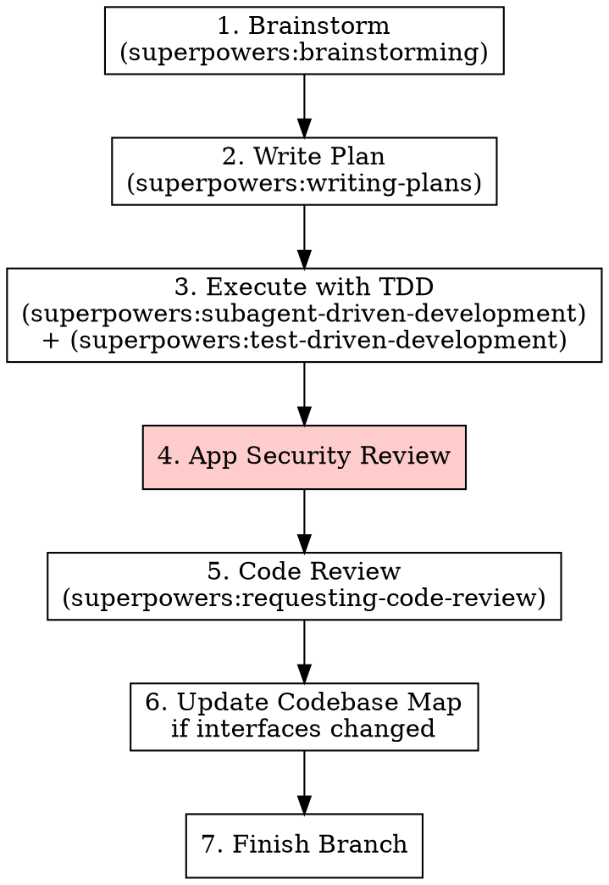

# Staff SWE — Application Development

## Overview

Application code gets tested. Every feature, every bugfix, every behavior change goes through TDD. After implementation, a security review catches OWASP issues before code review.

**This skill wraps test-driven-development (not replaces it) and adds a security gate.**

## When to Use

**Always when:**
- Writing application code, agents, services, APIs, or frontends
- The project CLAUDE.md says "use staff-swe"

**Never when:**
- Working on Terraform, Helm, or CI/CD (use staff-sre instead)

## Pipeline

## Steps 1-3: Use Superpowers As-Is

These steps use existing Superpowers skills unchanged:

1. **Brainstorming** — `superpowers:brainstorming`. Design before code. Hard-gated: no code until design approved.
2. **Writing Plans** — `superpowers:writing-plans`. Bite-sized TDD tasks with exact file paths, test code, and verification commands.
3. **Execute with TDD** — `superpowers:subagent-driven-development` + `superpowers:test-driven-development`. Red-green-refactor. No exceptions. Follow commit conventions from `~/.claude/CLAUDE.md`.

## Step 4: App Security Review

**Before requesting code review, check:**

| Check | What to Look For |
|-------|-----------------|
| **Injection** | No string concatenation in SQL/shell/template commands. Use parameterized queries, prepared statements. |
| **Authentication** | Auth checks on every protected endpoint. No auth bypass via path manipulation. |
| **Secrets** | No hardcoded credentials, API keys, or tokens. All secrets from env vars or secret stores. |
| **Input validation** | User input validated at system boundaries. Reject unexpected types/sizes. |
| **Dependencies** | No known CVEs in direct dependencies. Pin versions, don't use `latest`. |
| **Error handling** | Errors don't leak stack traces, internal paths, or credentials to callers. |
| **Logging** | No PII or secrets in log output. Structured logging with appropriate levels. |

**Found an issue?** Fix it before code review. Security issues don't get deferred.

## Step 6: Update Codebase Map

If this work changed a module/service interface (new endpoints, changed exports, renamed functions):

1. Read `~/.claude/projects/<project-path>/CLAUDE.md`
2. Update the relevant entry in the Codebase Map
3. Keep concise — one-liner + key interfaces

**Skip if:** Only internal changes (no interface change).

## Step 7: Finish Branch

Use `superpowers:finishing-a-development-branch`. When submitting, use `$STACK_SUBMIT_CMD` from `~/.config/claude/workflow.env` if stacking PRs.

## Integration with Other Skills

| Skill | Status |
|-------|--------|
| brainstorming | **Use as-is** |
| writing-plans | **Use as-is** (TDD task structure) |
| test-driven-development | **Use as-is** — this is the core verification method |
| subagent-driven-development | **Use as-is** |
| verification-before-completion | **Use as-is** |
| requesting-code-review | **Use as-is** — after security review |
| finishing-a-development-branch | **Use as-is** — use `$STACK_SUBMIT_CMD` if available |
